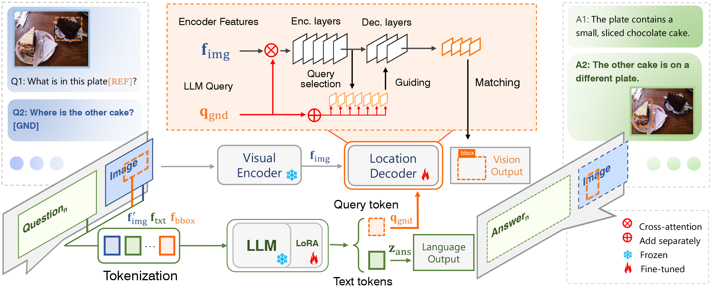

<div align="center">
<h1>ChatterBox </h1>

<h3> ChatterBox: Multi-round Multimodal Referring and Grounding</h3>


[Yunjie Tian*](https://sunsmarterjie.github.io/)<sup>1</sup>, Tianren Ma*<sup>1</sup>, [Lingxi Xie](https://scholar.google.com.hk/citations?user=EEMm7hwAAAAJ&hl=zh-CN&oi=ao)<sup>2</sup>, Jihao Qiu<sup>1</sup>, Xi Tang<sup>1</sup>, Yuan Zhang<sup>1</sup>, Jianbin Jiao<sup>1</sup>, [Qi Tian](https://scholar.google.com.hk/citations?user=61b6eYkAAAAJ&hl=zh-CN&oi=ao)<sup>2</sup>, [Qixiang Ye](https://scholar.google.com.hk/citations?user=tjEfgsEAAAAJ&hl=zh-CN&oi=ao)<sup>1</sup> 

<sup>1</sup>  University of Chinese Academy of Sciences, <sup>2</sup>  HUAWEI Inc.

Paper: ([arXiv 2401.10166](https://arxiv.org/abs/2401.10166))

</div>


## Abstract

In this study, we establish a baseline for a new task named multimodal multi-round referring and grounding (MRG), opening up a promising direction for instance-level multimodal dialogues. We present a new benchmark and an efficient vision-language model for this purpose. The new benchmark, named CB-300K, spans challenges including multi-round dialogue, complex spatial relationships among multiple instances, and consistent reasoning, which are beyond those shown in existing benchmarks. The proposed model, named ChatterBox, utilizes a two-branch architecture to collaboratively handle vision and language tasks. By tokenizing instance regions, the language branch acquires the ability to perceive referential information. Meanwhile, ChatterBox feeds a query embedding in the vision branch to a token receiver for visual grounding. A two-stage optimization strategy is devised, making use of both CB-300K and auxiliary external data to improve the model's stability and capacity for instance-level understanding. Experiments show that ChatterBox outperforms existing models in MRG both quantitatively and qualitatively, paving a new path towards multimodal dialogue scenarios with complicated and precise interactions. 


## Overview

<p align="center">
    </a> <br>
    The architecture of the ChatterBox model. 
</p>


Key Contributions:

* **CB-300K** - We establish the **CB-300K benchmark** to facilitate the research in multi-round referring and grounding.
* **Chatterbox Model** - We establish the ChatterBox model in a dual-branch architecture to solve multi-round referring and grounding problem.

# We emphasize that the proposed multi-round referring and grounding (MRG) is not equivalent to multi single-round referring and grounding. We stress the importance of logical relation between dialogues (see [CB-LC](https://drive.google.com/file/d/1C0XyMyhLRzdSDbtWAiGdW1rjljop0sMe/view?usp=sharing)), which is crucial for an interactive chat agent.


## Updates
 * **` Jan. 24th, 2024`:** The [paper](https://arxiv.org/abs/2310.07704), code, and [dataset](CB-300K) is released.


## Release


## Contents

- [Install](#install)
- [Train](#train)
- [Evaluation](#evaluation)
- [Demo](#demo)

## Install

1. Clone this repository and navigate to ChatterBox folder

```bash
git clone https://github.com/sunsmarterjie/ChatterBox
cd ChatterBox
```

2. Install Packages

```Shell
conda create -n chatterbox python=3.11.5 
conda activate chatterbox
pip install --upgrade pip  # enable PEP 660 support
pip install -r requirements.txt
pip install deepspeed
unzip mmcv-1.4.7.zip
cd mmcv-1.4.7/
MMCV_WITH_OPS=1 pip install -e .
cd ../model/GroundingDINO/ops
python setup.py build install
```


## Train

We build visual branch of ChatterBox using [GroundingDINO](https://github.com/IDEA-Research/GroundingDINO) and [DINO](https://github.com/IDEA-Research/DINO), we provide GroundDINO version now. 

* Prepare datasets/models:

Download [CB-300K](CB-300K), [VG](https://homes.cs.washington.edu/~ranjay/visualgenome/api.html), [COCO2017](https://cocodataset.org/#download), [COCO2014](https://cocodataset.org/#download), [RefCOCO](https://web.archive.org/web/20220413011718/https://bvisionweb1.cs.unc.edu/licheng/referit/data/refcoco.zip), [RefCOCO+](https://web.archive.org/web/20220413011656/https://bvisionweb1.cs.unc.edu/licheng/referit/data/refcoco+.zip), [RefCOCOg](https://web.archive.org/web/20220413012904/https://bvisionweb1.cs.unc.edu/licheng/referit/data/refcocog.zip), [Flickr30K](https://shannon.cs.illinois.edu/DenotationGraph/), [OpenSource](https://drive.google.com/file/d/1mHIm6u9D2SuUyGoQQI4bO7GC9ecjY_Y5/view?usp=sharing), [clip-vit-large-patch14](https://huggingface.co/openai/clip-vit-large-patch14), [
LLaVA-Instruct-150K](https://huggingface.co/datasets/liuhaotian/LLaVA-Instruct-150K/blob/main/llava_instruct_150k.json), [llava-llama-2-13b](https://huggingface.co/liuhaotian/llava-llama-2-13b-chat-lightning-preview/tree/main), [CB-materials](https://drive.google.com/drive/folders/1fskSZBmJ79uVd5aXAUJVmaZN4tvKM5Hd?usp=sharing), [groundingdino_swinb](https://github.com/IDEA-Research/GroundingDINO/releases/download/v0.1.0-alpha2/groundingdino_swinb_cogcoor.pth).

```
├── datasets
|   ├── CB-300K
|   |    ├── CB-MRG
|   |    ├── CB-LC
│   │    └── ...
|   ├── VG
|   |    ├── VG_100K
|   |    ├── VG_100K_2
│   │    └── ...
│   ├── MSCOCO2017
|   |    ├── train2017
│   │    └── ...
│   ├── MSCOCO2014
|   |    ├── train2014
│   │    └── ...
│   ├── Flickr30K
|   |    ├── flickr30k-images
│   │    └── ...
│   ├── llava_instruct_150k.json
|   ├── CB_materials
|   |    ├── CB-refcoco-GND
|   |    ├── CB-coco-GND
|   |    ├── CB-refcoco-REF
│   │    └── ...
│── clip-vit-large-patch14
|             ├── config.json
│             └── ...
│── llava-llama-2-13b-chat-lightning-preview
|                      ├── config.json
│                      └── ...
│── OpenSource
|        ├── finetune_refcoco_train.json
|        ├── finetune_refcoco+_train.json
│        └── ...
├── groundingdino_swinb_cogcoor.pth
```

* Train ChatterBox on 8xA800 GPUs (80GB).

```
python startup_stage1.py  # stage1
python startup_stage2.py  # stage2
```


## Evaluation

See details at [evaluation](evaluation/readme.md).


## Demo

Coming soon


## Citation

If this project has been helpful or if you've used our dataset, please cite:
```
@article{tian2024chatterbox,
  title={ChatterBox: Multi-round Multimodal Referring and Grounding},
  author={Tian, Yunjie and Ma, Tianren and Xie, Lingxi and Qiu, Jihao and Tang, Xi and Zhang, Yuan and Jiao, Jianbin and Tian, Qi and Ye, Qixiang},
  journal={arXiv preprint arXiv:2401.10166},
  year={2024}
}
```

## Acknowledgment

This project is based on LLaVA ([paper](https://arxiv.org/abs/2304.08485), [code](https://github.com/haotian-liu/LLaVA)), LISA ([paper](https://arxiv.org/abs/2308.00692), [code](https://github.com/dvlab-research/LISA)), GPT4RoI ([paper](https://arxiv.org/abs/2307.03601), [code](https://github.com/jshilong/GPT4RoI)), thanks for their excellent works.
